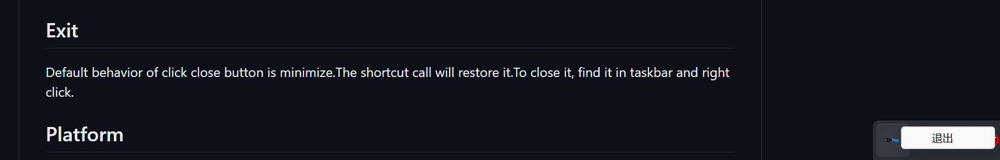

# MixTex-rs GUI

A GUI implement of [MixTex](https://github.com/RQLuo/MixTeX-Latex-OCR/tree/MixTeX-v1.1.2), use [Rust](https://www.rust-lang.org/) + [Vue](https://github.com/vuejs/) + [Tauri]([https://github.com/tauri-apps/tauri] )

##  Setup and Usage

- Download installer for your system from [Release](https://github.com/MosRat/MixTex-rs-GUI/releases/latest), or single exe (Windows only)
- Use `Shift + X` or `Ctrl + Alt + F12` to screenshot latex. (can be changed in future version)
- Or drag png/jp(e)g image into app
- Or click `Select` to choose one from filesystem.

## Exit
Default behavior of click close button is minimize.The shortcut call will restore it.To close it, find it in taskbar and right click.

## Platform

**No tests on Linux and Mac yet**

I only have Windows PC. Release of other systems is auto created by github actions.

